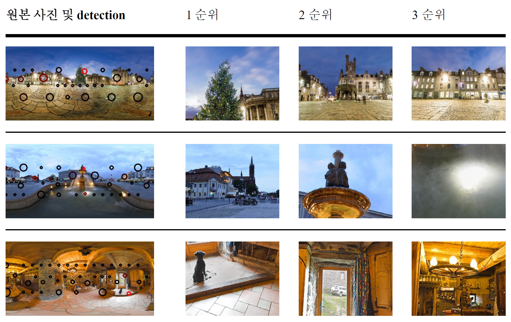

phototaker
=============
# Notice

본 프로젝트는 포항공과대학교 2016년 가을학기 과제연구 프로젝트로 제작되었다.

# Introduction

이 프로젝트의 목표는 360도 사진에서 자동으로 흥미로운 곳을 찾아 일반적이면서도 보기 좋은 2D 사진을 추출하는 것이다. Image saliency와 사진술에 대한 이해를 기반으로 접근하였다.

# Dependencies

	Visual Studio 2017
	OpenCV 3.1.0

# Results

# Further information

설계 과정이나 이론적 배경 혹은 참고자료는 같이 첨부된 보고서에 자세히 적혀있다.